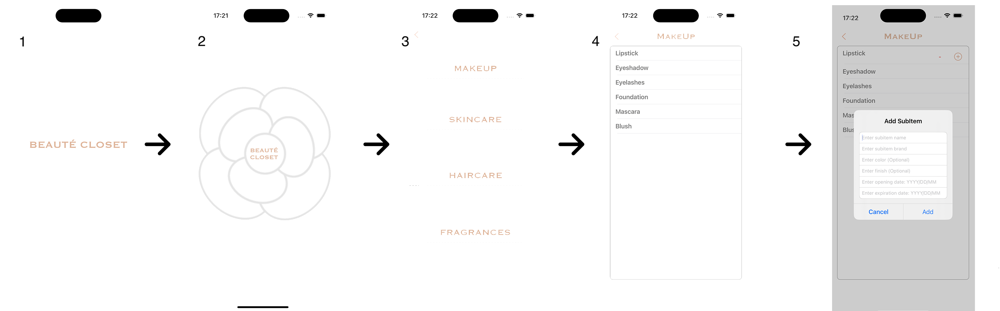
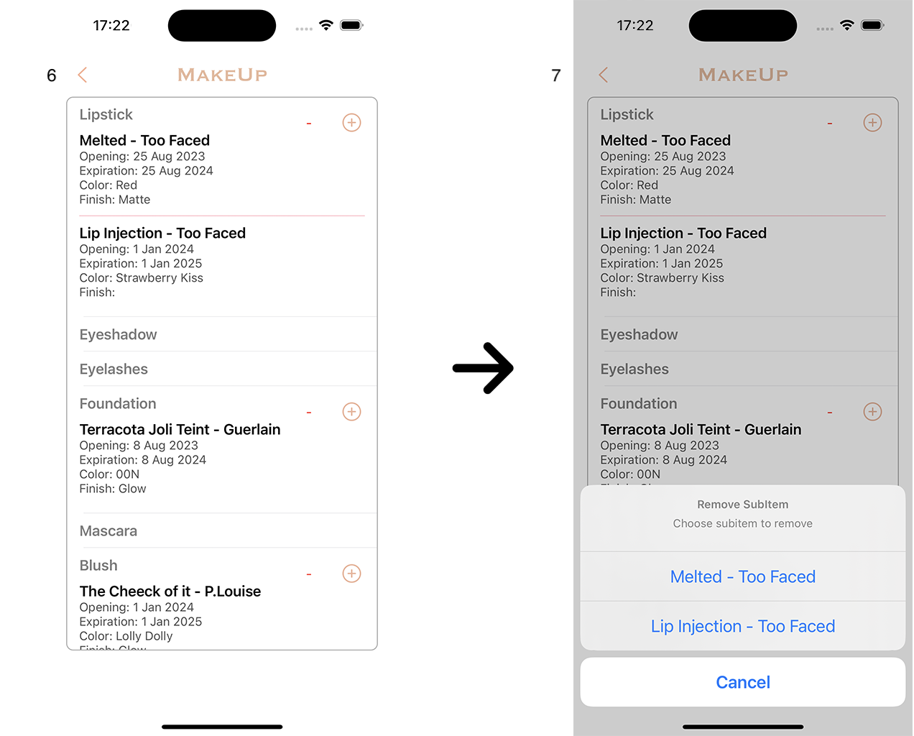

# Make Up Closet

## Geral Information

This app is like your personal organizer for makeup, skincare, haircare, and fragrances. You can add, remove, and check out all your beauty products in different categories. Each category gets its own page where you can dive into the details, like adding or removing specific items. The app keeps track of everything so you don't have to worry about losing your favorite products.

Each item has its own page with cells corresponding to sub-items of these items; the cells have the option to add items you have or remove them.

1. App's launch screen. 
2. Starting screen; to use the app, simply click on 'Beauté Closet.' 
3. Menu with options. 
4. The fourth image shows cells of items belonging to makeup. 
5. In this image, you can see how a sub-item is added to the cell. To add, simply expand the cell of the desired option and click on the '+' icon.

6. After adding an item, it should appear on the screen. 
7. To add items from other categories, simply expand the cell. To delete items, just click on the '-' icon and choose the item to remove.

## Additional Information

This app is built for iOS using `Swift`, `UIKit` and `Storyboard`. It uses UserDefaults to store data locally, so you can keep track of your makeup, skincare, haircare, and fragrances. The interface is made with UITableView, making it easy to scroll through your items. Each category has its own page, and you can add or remove items with just a tap.

